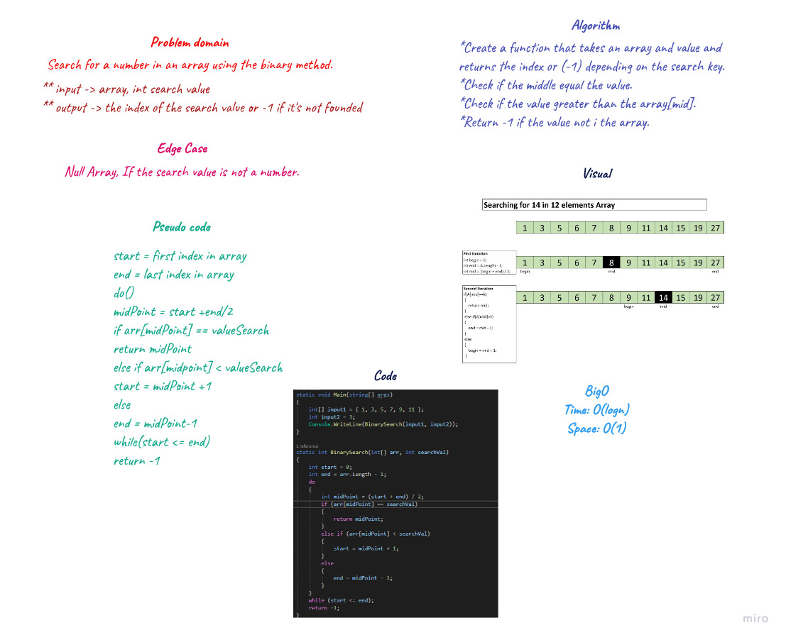

# Array Binary Search 
Write a function called BinarySearch which takes in 2 parameters: a sorted array and the search key. Without utilizing any of the built-in methods available to your language, return the index of the array’s element that is equal to the value of the search key, or -1 if the element is not in the array.

## Whiteboard process

## Approach and Efficiency
Big O Time = O(log n) // Big O Space = O(1)
> The iterative approach to binary search comes with a logn time because the array is continually being divided in half after every comparison. Since no other space is being analyzed or used, it stays at O(1).