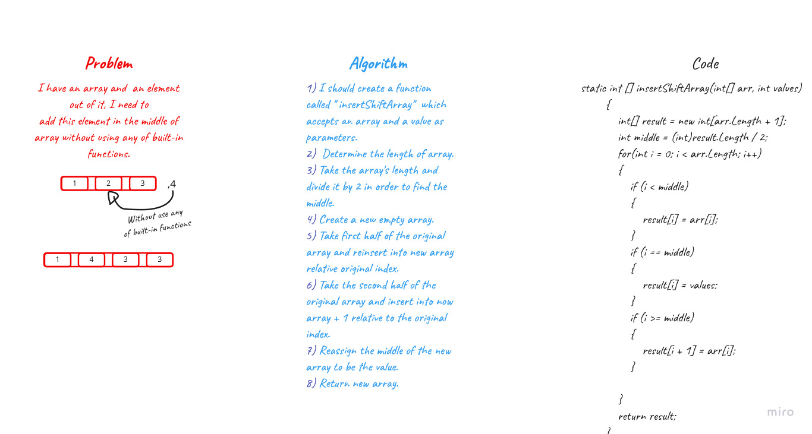
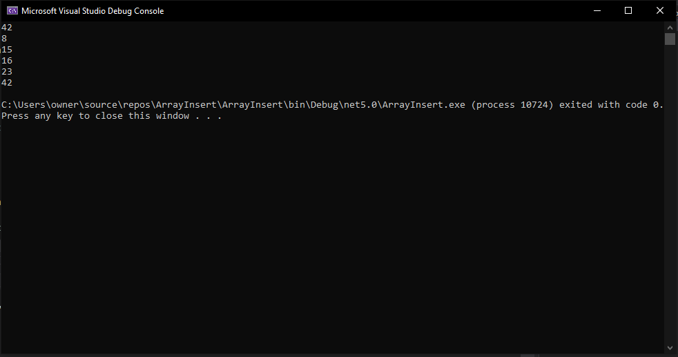

# Array Insert Shift

>I have an array and  an element out of it, I need to
add this element in the middle of array without using any of built-in functions.

## Whiteboard 



## Code 
```
static int [] insertShiftArray(int[] arr, int values)
        {
            int[] result = new int[arr.Length + 1];
            int middle = (int)result.Length / 2;
            for(int i = 0; i < arr.Length; i++)
            {
                if (i < middle)
                {
                    result[i] = arr[i];
                }
                if (i == middle)
                {
                    result[i] = values;
                }
                if (i >= middle)
                {
                    result[i + 1] = arr[i];
                }
                
            }
            return result;
        }
```

# Output

