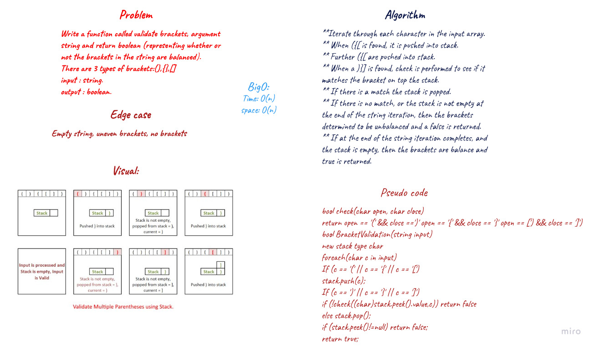

# Multi-bracket Validation.

## Descripe of challenge: 
> Determine if the string containing brackets is ***balanced***

## Challenge Summary
Write a function should take a string as its only argument, and should return a boolean representing whether or not the brackets in the string are balanced.
There are 3 types of brackets:

* Round Brackets : ()
* Square Brackets : []
* Curly Brackets : {}

## Whiteboard Process

## Approach & Efficiency
>Time: O(n) since it iterates the length of the string.

>Space: O(n) since a new Stack was created to store brackets.